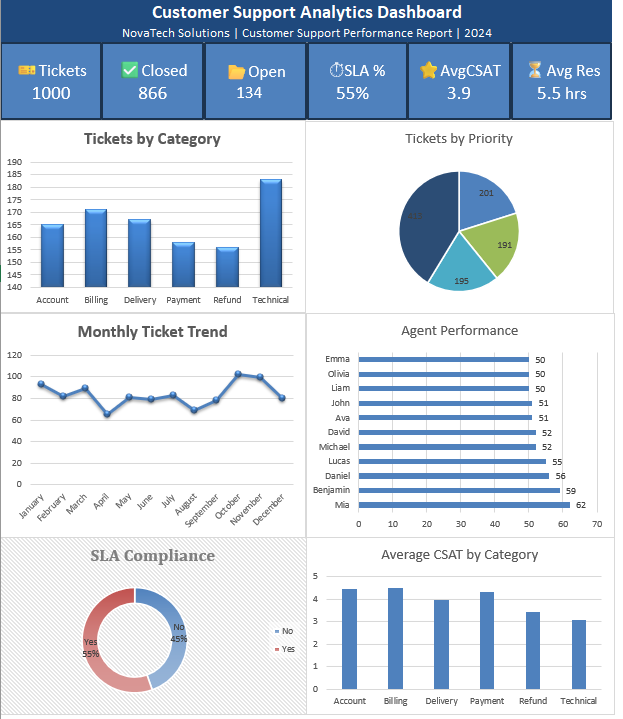
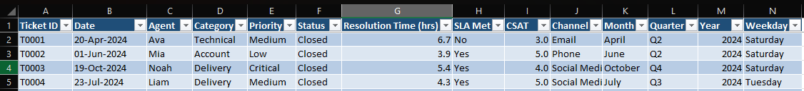
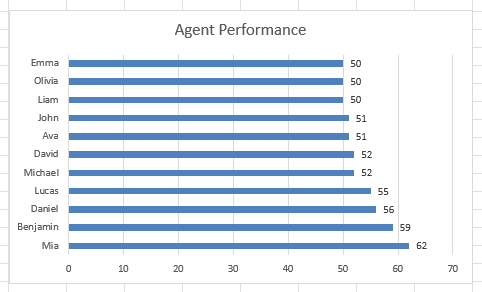
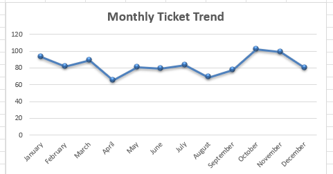
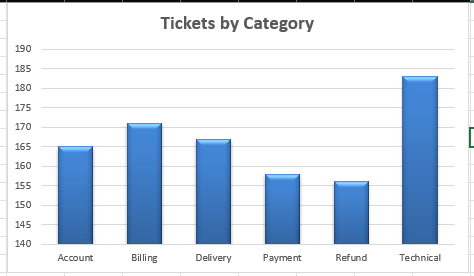
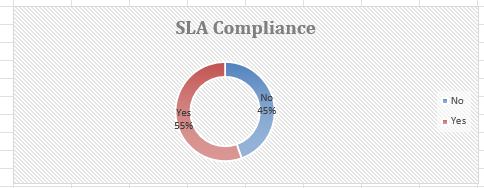

# 📊 Customer Support Analytics Dashboard using Microsoft Excel


An interactive Customer Support Analytics Dashboard built using Microsoft Excel to analyze support ticket performance, customer satisfaction, SLA compliance, and agent productivity.

---

## 📸 Dashboard Preview

> Replace the image below after uploading `dashboard.png` to the Images folder.


---
---

# 📷 Project Screenshots

## 📊 Dashboard



---

## 📑 Raw Dataset



---

## 📈 Pivot Tables


---

## 👨‍💻 Agent Performance



---

## 📅 Monthly Ticket Trend



---

## 🎫 Tickets by Category



---

## ⏱️ SLA Compliance


---
## 📌 Project Overview

This project demonstrates how Microsoft Excel can be used to transform raw customer support data into meaningful business insights through interactive dashboards.

The dashboard helps management monitor ticket volume, support performance, SLA compliance, and customer satisfaction using Pivot Tables, Pivot Charts, and Excel formulas.

---

## 🎯 Business Problem

Customer support teams handle hundreds of support requests every day. Without proper reporting, it becomes difficult to monitor performance, identify bottlenecks, and improve customer experience.

This dashboard provides a centralized view of key support metrics, enabling data-driven decision-making.

---

## 📂 Dataset

The dataset contains **1,000 customer support tickets** with the following fields:

- Ticket ID
- Date
- Agent Name
- Category
- Priority
- Status
- Resolution Time (Hours)
- SLA Met
- CSAT Score
- Support Channel
- Month
- Quarter
- Year
- Weekday

---

## 📊 Dashboard Features

- 📌 Total Tickets
- ✅ Closed Tickets
- 📂 Open Tickets
- ⏱ SLA Compliance
- ⭐ Average Customer Satisfaction (CSAT)
- ⏳ Average Resolution Time
- 📈 Monthly Ticket Trend
- 👩‍💻 Agent Performance
- 🎫 Tickets by Category
- 🚨 Tickets by Priority

---

## 🛠️ Tools & Technologies

- Microsoft Excel
- Pivot Tables
- Pivot Charts
- Excel Formulas
- Conditional Formatting
- Data Visualization

---

## 📁 Repository Structure

```text
customer-support-analytics-dashboard-excel/
│
├── Dashboard/
│   ├── Customer Support Dashboard.xlsx
│   └── Dashboard Guide.md
│
├── Dataset/
│   ├── customer_support_data.xlsx
│   └── Data Dictionary.md
│
├── Documentation/
│   ├── Business Problem.md
│   ├── Dashboard KPIs.md
│   └── Business Insights.md
│
├── Images/
│   ├── dashboard.png
│   ├── raw-data.png
│   ├── pivot-tables.png
│   ├── tickets-by-category.png
│   ├── monthly-ticket-trend.png
│   ├── sla-compliance.png
│   └── agent-performance.png
│
├── README.md
└── LICENSE
```

---

## 💡 Key Business Insights

- Technical issues generated the highest number of support tickets.
- SLA compliance was approximately **55%**.
- Average CSAT was around **3.94/5**.
- Ticket volume varied across different months.
- Agent performance analysis helps identify workload distribution.

---

## 🚀 Skills Demonstrated

- Data Cleaning
- Data Analysis
- Dashboard Development
- Business Intelligence Reporting
- KPI Design
- Pivot Table Analysis
- Data Visualization

---

## 🔮 Future Improvements

- Build an interactive Power BI dashboard
- Perform SQL-based customer support analysis
- Develop an ML model to predict ticket priority
- Add automated reporting with Power Query

---

## 👩‍💻 Author

**Lingeshwari M**

Aspiring Data Analyst | Data Science & AI Enthusiast

GitHub: https://github.com/lingeshwarieashwari-wq
